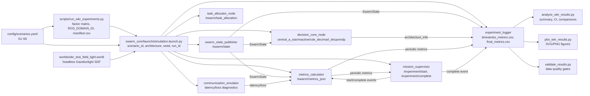

# UML-диаграмма стенда симуляции

## Основной поток данных

1. Runner формирует пары `scenario_id x architecture x seed` и запускает `simulation.launch.py`.
2. Launch передает единые параметры всем узлам стенда.
3. `swarm_state_publisher` публикует состояние агентов, `metrics_calculator` считает coverage/connectivity/energy/collisions.
4. `mission_supervisor` завершает run по критериям успеха или timeout.
5. `experiment_logger` пишет одну финальную строку на `run_id` и отдельный timeseries CSV.
6. Analyze/plot/validate работают только с `final_metrics.csv`, не меняя исходные данные.
