# Simulation stand UML and data-flow diagrams

Документ описывает симуляционный стенд как ROS 2-ориентированный модульный test bench.

## Component/data-flow diagram

```mermaid
flowchart LR
    Runner["scripts/run_wkr_experiments.py\nfactor matrix, ROS_DOMAIN_ID, manifest.csv"]
    Launch["swarm_core/launch/simulation.launch.py\nscenario_id, architecture, seed, run_id"]
    Scenario["config/scenarios.yaml\nS1-S6"]
    World["worlds/wkr_test_field_light.world\nheadless/light simulation world"]
    State["swarm_state_publisher\n/swarm/state"]
    Decision["decision_core_node\ncentral_a_star/reactive/rule_dec/decpomdp_heuristic"]
    Alloc["task_allocator_node\n/swarm/task_allocation"]
    Comm["communication_emulator\nlatency/loss diagnostics"]
    Metrics["metrics_calculator\n/swarm/metrics_json"]
    Supervisor["mission_supervisor\n/experiment/start, /experiment/complete"]
    Logger["experiment_logger\ntimeseries_metrics.csv, final_metrics.csv"]
    Analyze["analyze_wkr_results.py\nsummary, CI, comparisons"]
    Plot["plot_wkr_results.py\nPNG/SVG figures"]
    Validate["validate_results.py\ndata quality gates"]

    Runner --> Launch
    Scenario --> Runner
    Scenario --> Launch
    World --> Launch
    Launch --> State
    Launch --> Decision
    Launch --> Alloc
    Launch --> Comm
    Launch --> Metrics
    Launch --> Supervisor
    Launch --> Logger
    State -->|SwarmState| Decision
    State -->|SwarmState| Metrics
    State -->|SwarmState| Logger
    Decision -->|architecture_info| Logger
    Comm -->|latency/loss| Metrics
    Metrics -->|periodic metrics| Supervisor
    Metrics -->|periodic metrics| Logger
    Supervisor -->|start/complete events| Metrics
    Supervisor -->|complete event| Logger
    Logger --> Analyze
    Logger --> Plot
    Logger --> Validate
```

## Main data path

1. `run_wkr_experiments.py` формирует пары `scenario_id x architecture x seed`.
2. `simulation.launch.py` передает унифицированные параметры в узлы стенда.
3. `swarm_state_publisher` публикует состояния агентов.
4. `decision_core_node` выбирает управляющую стратегию.
5. `communication_emulator` моделирует задержки и потери сообщений.
6. `metrics_calculator` считает coverage, connectivity, collisions, energy и integral score.
7. `mission_supervisor` завершает прогон по критериям успеха или timeout.
8. `experiment_logger` записывает `timeseries_metrics.csv` и одну финальную строку в `final_metrics.csv`.
9. `validate_results.py`, `analyze_wkr_results.py` и `plot_wkr_results.py` читают `final_metrics.csv` без ручного изменения исходных данных.
