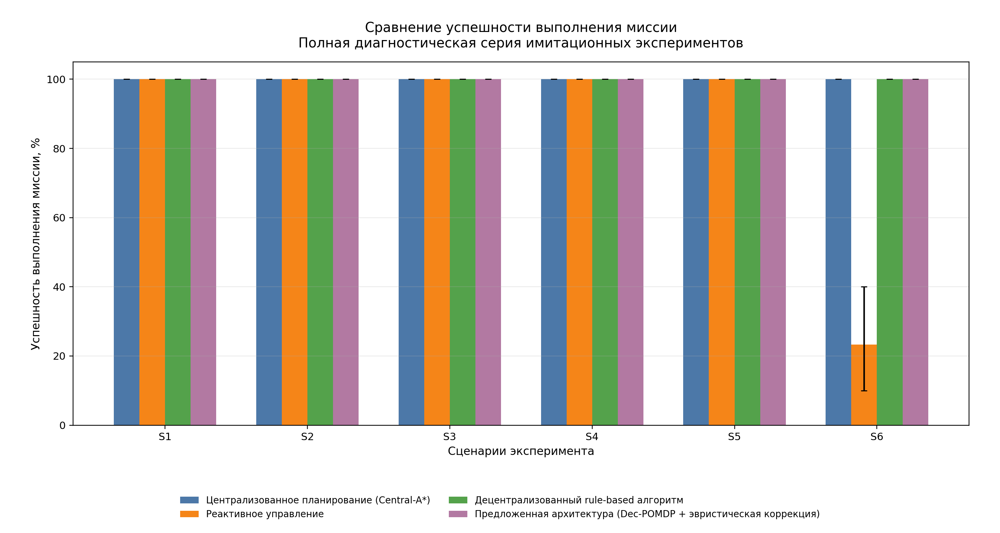
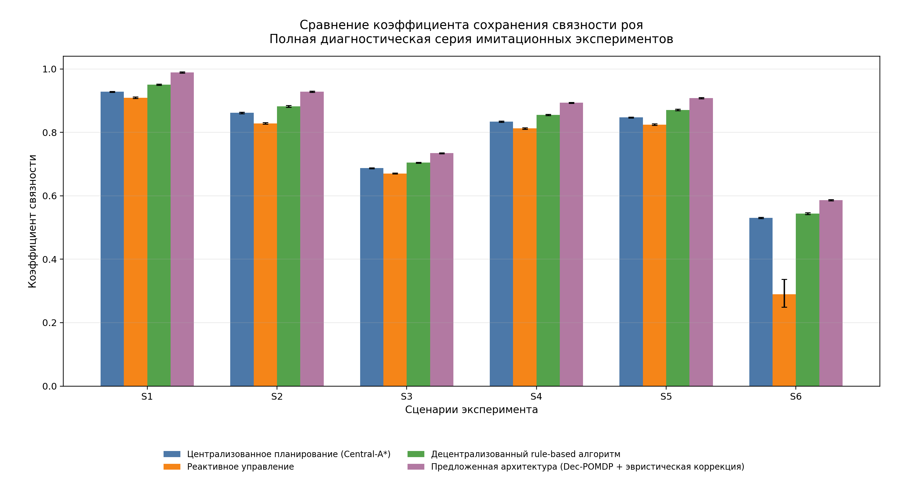
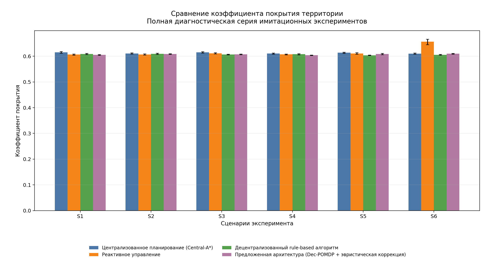
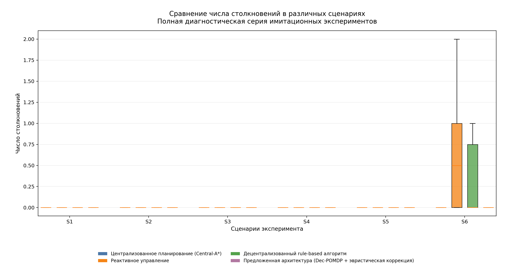
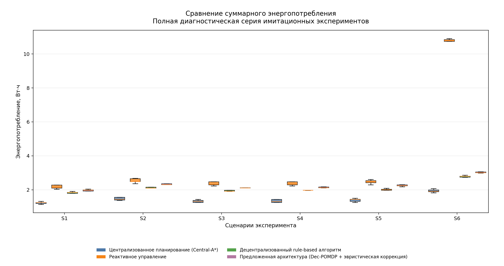
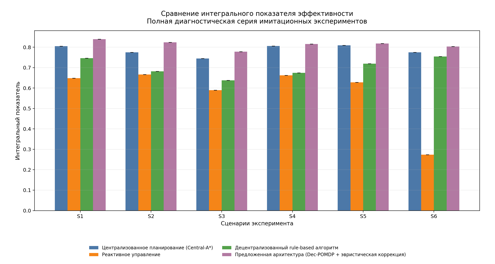

# Отчет о проделанной работе

## 1. Назначение отчета

Подготовлен комплект документации для симуляционного стенда роя автономных агентов. Отчет основан на фактических артефактах ветки `fix/wkr-experiment-validation`: таблицах из `docs/tables/wkr`, графиках из `docs/figures/wkr`, UML/data-flow описании стенда и описании экспериментальной методики.

## 2. Что сделано

1. Подготовлен  `README.md`.
2. Описана архитектура симуляционного стенда в терминах ROS 2 pipeline.
3. Добавлены команды локального запуска и запуска в Docker-контейнере.
4. Зафиксированы режимы `quick`, `full-diagnostic` и `full-proof`.
5. Перенесены и нормализованы таблицы диагностической серии.
6. По реальным значениям таблицы средних метрик построены графики:
   - связность;
   - покрытие;
   - столкновения;
   - энергопотребление;
   - интегральный показатель;
   - успешность;
   - валидность запусков.
7. Подготовлено UML/data-flow описание взаимодействия модулей.
8. Разделены диагностический режим и MARL proof-режим.

## 3. Экспериментальная матрица

Полная серия включает:

```text
6 сценариев × 4 архитектуры × 30 seed = 720 запусков
```

| Сценарий | Описание | Количество запусков |
|---|---|---:|
| S1 | Номинальная навигация при штатной связи и умеренной плотности препятствий | 120 |
| S2 | Плотное препятственное окружение | 120 |
| S3 | Деградация связи: потери пакетов и повышенная задержка | 120 |
| S4 | Частичный отказ агентов в ходе миссии | 120 |
| S5 | Вычислительная деградация и задержка принятия решений | 120 |
| S6 | Комбинированный стресс: препятствия, связь, отказы и вычислительная деградация | 120 |

Архитектуры:

| Код | Назначение |
|---|---|
| `central_a_star` | Централизованное планирование |
| `reactive` | Реактивное локальное управление |
| `rule_dec` | Децентрализованный rule-based алгоритм |
| `decpomdp_heuristic` | Dec-POMDP + эвристическая коррекция |

## 4. Сводка валидности

| Показатель | Значение |
|---|---:|
| Всего запусков | 720 |
| valid_success | 697 |
| valid_failure | 23 |
| diagnostic rows | 0 |
| incomplete_or_timeout | 0 |
| runner_timeout_reached | 0 |
| Общая успешность | 96.8 % |


Вывод: набор результатов пригоден для анализа, так как отсутствуют неполные запуски, диагностические строки и внешние timeout-состояния runner-а.

## 5. Успешность по сценариям



В сценариях S1-S5 все архитектуры достигают 100% успешности. В сценарии S6 реактивный алгоритм снижается до 23.3%, что показывает чувствительность простой локальной стратегии к комбинированному стрессу.

## 6. Коэффициент связности



`decpomdp_heuristic` показывает наибольшую среднюю связность во всех сценариях. Наиболее сильная деградация связности наблюдается в S3 и S6, где явно моделируются ухудшение связи и комбинированные неблагоприятные факторы.

## 7. Коэффициент покрытия



Метрика покрытия находится в близком диапазоне для большинства архитектур. Это означает, что в headless-кинематической модели все основные архитектуры способны достигать целевой области покрытия, а различия лучше проявляются по связности, безопасности, энергии и интегральной оценке.

## 8. Число столкновений



Минимальные значения столкновений демонстрирует `decpomdp_heuristic`: в S1, S3, S4 и S5 среднее число столкновений равно 0. В S6 столкновения растут у всех архитектур, но реактивная архитектура показывает худшее значение.

## 9. Энергопотребление



`central_a_star` является наиболее энергоэффективной архитектурой во всех сценариях. Это инженерный компромисс: Dec-POMDP + heuristic тратит больше энергии, но обеспечивает лучшую связность и лучший интегральный показатель.

## 10. Интегральный показатель эффективности



`decpomdp_heuristic` имеет лучший интегральный показатель во всех сценариях S1-S6. Особенно важно, что в S6 он сохраняет значение 0.8033, тогда как реактивный алгоритм падает до 0.2736.

## 11. Ключевые результаты по таблице средних метрик

| Сценарий | Лучший integral_score | Лучший connectivity | Лучший energy |
|---|---|---|---|
| S1 | `decpomdp_heuristic` | `decpomdp_heuristic` | `central_a_star` |
| S2 | `decpomdp_heuristic` | `decpomdp_heuristic` | `central_a_star` |
| S3 | `decpomdp_heuristic` | `decpomdp_heuristic` | `central_a_star` |
| S4 | `decpomdp_heuristic` | `decpomdp_heuristic` | `central_a_star` |
| S5 | `decpomdp_heuristic` | `decpomdp_heuristic` | `central_a_star` |
| S6 | `decpomdp_heuristic` | `decpomdp_heuristic` | `central_a_star` |

## 12. Архитектурная интерпретация

Результаты показывают, что простая успешность выполнения миссии недостаточно чувствительна для сравнения архитектур: в S1-S5 она близка к насыщению. Поэтому основное сравнение следует вести по связности, столкновениям, энергопотреблению и интегральному показателю.

Вероятностно-эвристический контур `decpomdp_heuristic` обеспечивает наиболее устойчивое поведение, поскольку учитывает:
- качество связности;
- риск столкновений;
- энергетическое состояние;
- деградацию связи;
- отказ части агентов.

Централизованный `central_a_star` остается сильным baseline по энергопотреблению, но не дает максимальной связности. Реактивный baseline является самым слабым в комбинированном стресс-сценарии.

## 13. Ограничения

1. Серия выполнена в режиме `headless_fast_kinematic`; результаты не заменяют полноценную Gazebo/DDS-валидацию.
2. Обученная MARL-политика не использовалась в доказательной серии.
3. `models/marl/test_policy.pt` допустим только для smoke/plumbing-проверок.
4. Сырые сенсорные потоки не моделировались; использовалось агрегированное состояние среды.
5. Время выполнения миссии не используется как основной показатель из-за требований к надежной фиксации start/complete-событий.

## 14. Вывод

Подготовлен воспроизводимый симуляционный стенд с валидированной диагностической серией из 720 запусков. Пайплайн логирования, валидации, анализа и построения графиков работает корректно. Данные подтверждают преимущество `decpomdp_heuristic` по связности и интегральной эффективности, а также энергоэффективность `central_a_star`. Следующий инженерный этап — обучение proof-valid MARL checkpoint и физически более детальная Gazebo/DDS-валидация.
